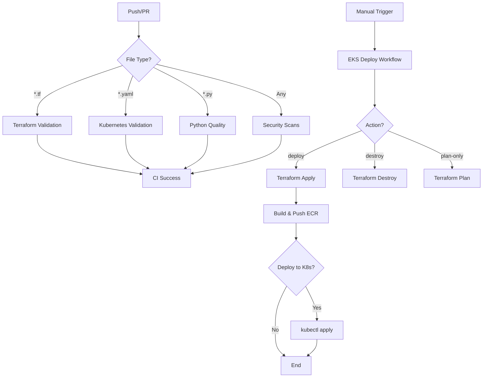

# GitHub Actions Workflows

This directory contains the CI/CD and security workflows for this repository. The YAML files in `.github/workflows/` are the source of truth for what currently runs in automation.

## Current Workflows

The following workflows exist in this repository (see each file for exact behavior):

- [`ci.yml`](ci.yml:1) — Core CI pipeline (linting, tests, security and quality checks).
- [`codeql.yml`](codeql.yml:1) — CodeQL static analysis.
- [`scorecard.yml`](scorecard.yml:1) — OpenSSF Scorecard checks.
- [`security-gate.yml`](security-gate.yml:1) — Security and vulnerability gate (current implementation; see file for actual enforced logic).
- [`nightly-resource-audit.yml`](nightly-resource-audit.yml:1) — Nightly resource and hygiene audits.
- [`terraform-plan.yml`](terraform-plan.yml:1) — Terraform plan operations.
- [`terraform-apply.yml`](terraform-apply.yml:1) — Terraform apply operations.
- [`terraform-destroy-validation.yml`](terraform-destroy-validation.yml:1) — Safety checks for Terraform destroy workflows.
- [`terraform-manual.yml`](terraform-manual.yml:1) — Manual Terraform workflow entrypoints.
- [`test-oidc-aws.yml`](test-oidc-aws.yml:1) — OIDC and AWS integration testing.
- [`claude.yml`](claude.yml:1) — AI-assisted guidance workflow.
- [`claude-code-review.yml`](claude-code-review.yml:1) — AI-assisted code review.
- [`resolve-comments.yml`](resolve-comments.yml:1) — Comment resolution and automation helpers.

Always consult the workflow files themselves for precise triggers, conditions, and checks.

## Alignment with STREAMLINING_PLAN

[`STREAMLINING_PLAN.md`](../STREAMLINING_PLAN.md:1) is the authoritative specification for:

- The target CI/CD architecture and required workflows.
- Standardizing on `uv`, `ruff`, `mypy`, and `pytest` as the canonical toolchain.
- How security and quality gates (including future refinements to `security-gate.yml` and related workflows) should be structured.
- The ordered migration from the current workflow set to the target model.

Key points:

- This directory documents the current, implemented workflows.
- Any changes to CI, security gates, or new workflows MUST be designed to align with [`STREAMLINING_PLAN.md`](../STREAMLINING_PLAN.md:1).
- Planned or future workflows described in the plan (or enhancements to existing ones) are authoritative only once implemented here as concrete `.yml` files.

## Table of Contents

- [Infrastructure Workflows](#infrastructure-workflows)
- [CI/CD Workflows](#cicd-workflows)
- [Security Workflows](#security-workflows)
- [AI-Assisted Workflows](#ai-assisted-workflows)
- [Testing Workflows](#testing-workflows)
- [Quick Reference](#quick-reference)

---

## Infrastructure Workflows

### eks-deploy.yml

**Purpose**: Deploy and manage AWS EKS infrastructure via Terraform

**Trigger**: Manual (`workflow_dispatch`)

**Actions**:

- `bootstrap`: Create S3 backend and DynamoDB table (one-time setup)
- `plan-only`: Run terraform plan without applying
- `deploy`: Create/update EKS cluster, VPC, ECR, and optionally deploy to Kubernetes
- `destroy`: Fully destroy EKS infrastructure (keep security services)
- `destroy-eks-only`: Destroy only EKS cluster, keep VPC for faster recreation

**Inputs**:

| Input | Description | Type | Default |
|-------|-------------|------|---------|
| `action` | Action to perform | choice | `bootstrap` |
| `environment` | Environment to target | choice | `dev` |
| `image_tag` | Docker image tag | string | `v1.0.0` |
| `deploy_to_k8s` | Deploy to Kubernetes after ECR push | boolean | `false` |
| `auto_approve` | Auto-approve terraform apply (CAUTION) | boolean | `false` |

**Prerequisites**:

- AWS OIDC provider configured (see [docs/AWS_OIDC_SETUP.md](../../docs/AWS_OIDC_SETUP.md))

**Usage**:

```bash
# Bootstrap backend (one-time setup)
gh workflow run eks-deploy.yml -f action=bootstrap

# Plan only (no changes)
gh workflow run eks-deploy.yml -f action=plan-only

# Deploy EKS cluster + ECR
gh workflow run eks-deploy.yml -f action=deploy -f image_tag=v1.0.0

# Deploy EKS + ECR + deploy to Kubernetes
gh workflow run eks-deploy.yml \
  -f action=deploy \
  -f image_tag=v1.0.0 \
  -f deploy_to_k8s=true

# Destroy EKS cluster only (keep VPC)
gh workflow run eks-deploy.yml -f action=destroy-eks-only

# Full destruction
gh workflow run eks-deploy.yml -f action=destroy
```

**Jobs**:

1. **bootstrap-backend**: Create S3 bucket and DynamoDB table for Terraform state
2. **terraform-deploy**: Initialize, plan, and optionally apply Terraform changes
3. **build-and-push-ecr**: Build Docker image and push to ECR
4. **deploy-to-kubernetes**: Optionally deploy application to EKS
5. **terraform-destroy**: Destroy infrastructure (full or partial)

**Outputs**:

- Cluster information (name, endpoint, ECR repository URL)
- kubectl configuration command
- Cost reminders
- Next steps documentation links

**Cost**: ~$0.26/hour ($6.27/day) when EKS cluster is running

**Related Files**:

- `platform/scripts/bootstrap-eks-backend.sh` - Backend setup script
- `infra/aws-core/terraform/environments/dev/` - Terraform configurations
- `docs/terraform/operations/DEPLOYMENT_GUIDE.md` - Detailed deployment guide

---

## CI/CD Workflows

### ci.yml

**Purpose**: Core quality pipeline for this repository.

**Trigger**: Pull requests and pushes to `main`.

**Key Behavior (Phase 8 aligned)**:

- Uses `uv` for Python dependency management, with `pyproject.toml` + `uv.lock` as the source of truth.
- Runs the canonical gates:
  - `uv sync`
  - `uv run ruff check .`
  - `uv run ruff format --check .`
  - `uv run mypy`
  - `uv run pytest`
- May include additional non-breaking checks (e.g., IaC validation, linting) as implemented in the workflow.

Ruff is the canonical linter/formatter; mypy and pytest are required. Any changes to this workflow MUST remain consistent with [`STREAMLINING_PLAN.md`](../STREAMLINING_PLAN.md:1).

**Jobs**:

#### 1. Terraform Validation

- Format check (`terraform fmt`)
- Init, validate
- Security scanning (tfsec, Checkov)
- Linting (tflint)

#### 2. Kubernetes Validation

- Manifest validation (kubeval)
- Security linting (kube-linter)
- Trivy vulnerability scanning

#### 3. Python Quality

- Code formatting (Black)
- Linting (Ruff)
- Type checking (mypy)
- Unit tests with coverage (pytest)

#### 4. Docker Build & Security

- Multi-stage build
- Trivy vulnerability scanning
- Image signing (Cosign)
- SBOM generation (Syft)

#### 5. Security Scans

- Gitleaks (secret scanning)
- Semgrep (SAST)
- SonarCloud analysis

**Conditional Execution**: Jobs run based on file changes (e.g., Terraform jobs only run if `*.tf` files change)

**Related Documentation**:

- [CONTRIBUTING.md](../../CONTRIBUTING.md) - Code standards
- [SECURITY.md](../../SECURITY.md) - Security practices

---

## Security Workflows

### security-gate.yml

**Purpose**: Enforce security and vulnerability posture as part of the protected branch policy.

**Trigger**: As defined in the workflow (e.g., pull requests, pushes, or scheduled).

**Behavior (conceptual)**:

- Aggregates signals from security tooling (e.g., CodeQL alerts, Dependabot/IaC findings).
- Intended to block merges when HIGH/CRITICAL issues exist without an approved exception.

Treat `security-gate.yml` as part of the required security posture once wired into branch protection.

### codeql.yml

**Purpose**: CodeQL static application security testing (SAST).

**Trigger**:

- Pull requests to `main`
- Pushes to `main`
- Scheduled runs

**Notes**:

- Analyzed results surface in GitHub code scanning.
- Considered a required check for mainline quality and security once configured in branch protection.

### scorecard.yml

**Purpose**: OpenSSF Scorecard for repository-level security and hygiene.

**Trigger**:

- Pushes to `main`
- Scheduled runs

**Notes**:

- Evaluates practices such as branch protection, dependency pinning, and CI hardening.
- Part of the overall security posture described in [`STREAMLINING_PLAN.md`](../STREAMLINING_PLAN.md:1).

---

## AI-Assisted Workflows

### claude.yml

**Purpose**: AI-powered code suggestions and improvements

**Trigger**: Issue comment (`@claude`)

**Use Cases**:

- Code refactoring suggestions
- Bug fix recommendations
- Documentation improvements

---

### claude-code-review.yml

**Purpose**: Automated AI code review on pull requests

**Trigger**: Pull request events

**Features**:

- Code quality feedback
- Best practice suggestions
- Potential bug identification

---

## Testing Workflows

### test-oidc-aws.yml

**Purpose**: Test AWS OIDC authentication

**Trigger**:

- Manual (`workflow_dispatch`)
- Pushes to `infra/issue-15-oidc-aws` branch

**Tests**:

- OIDC authentication to AWS
- AWS identity verification
- S3 bucket access
- EC2 instance listing

**Usage**:

```bash
gh workflow run test-oidc-aws.yml
```

---

## Quick Reference

- Canonical Python toolchain: `uv` + `ruff` + `mypy` + `pytest`
- Canonical API entrypoint: `apps/api/main.py` (with `services/api` retained as compatibility shims)
- Security posture: `security-gate.yml`, `codeql.yml`, `scorecard.yml`, and related workflows cooperate to enforce quality and security baselines.

For authoritative targets and expectations, see [`STREAMLINING_PLAN.md`](../STREAMLINING_PLAN.md:1).

### Trigger Workflow Manually

```bash
# List all workflows
gh workflow list

# Run specific workflow
gh workflow run <workflow-name>.yml

# Run with inputs
gh workflow run eks-deploy.yml -f action=deploy -f image_tag=v2.0.0

# View workflow runs
gh run list --workflow=eks-deploy.yml

# Watch workflow run
gh run watch

# View workflow logs
gh run view <run-id> --log
```

### Check Workflow Status

```bash
# List recent runs
gh run list --limit 10

# View specific run
gh run view <run-id>

# Download artifacts
gh run download <run-id>
```

### Common Workflows

```bash
# Bootstrap EKS backend (one-time setup)
./platform/scripts/bootstrap-eks-backend.sh dev

# Deploy EKS infrastructure
gh workflow run eks-deploy.yml -f action=deploy

# Test OIDC authentication
gh workflow run test-oidc-aws.yml

# View CI pipeline status
gh run list --workflow=ci.yml --limit 5
```

---

## Workflow Inputs and Secrets

### Required Secrets

| Secret | Description | Used By |
|--------|-------------|---------|
| `SONAR_TOKEN` | SonarCloud authentication | `ci.yml` |
| None for AWS | Uses OIDC (no long-lived credentials) | `eks-deploy.yml`, `test-oidc-aws.yml` |

### OIDC Configuration

The project uses GitHub OIDC for AWS authentication (no access keys required):

- **Role ARN**: `arn:aws:iam::984479408136:role/GitHubActions-AssumeRoleForActions`
- **Region**: `us-west-2`
- **Provider**: `token.actions.githubusercontent.com`

See [docs/AWS_OIDC_SETUP.md](../../docs/AWS_OIDC_SETUP.md) for setup details.

---

## Best Practices

### Security

- ✅ **Pinned actions to commit SHAs** (supply chain security)
- ✅ **OIDC authentication** (no long-lived credentials)
- ✅ **Least privilege** permissions per job
- ✅ **Security scanning** in CI pipeline
- ✅ **Signed commits** and images (Cosign)

### Efficiency

- ✅ **Conditional job execution** based on file changes
- ✅ **Workflow artifacts** for plan review
- ✅ **Parallel jobs** where possible
- ✅ **Reusable actions** for common tasks

### Cost Management

- ✅ **Destroy reminders** in workflow outputs
- ✅ **Spot instances** for EKS nodes (70% savings)
- ✅ **Single NAT gateway** for dev environment
- ✅ **Auto-approve** option for testing (use with caution)

---

## Troubleshooting

### Workflow Fails with "Resource not found"

**EKS deploy workflow**: Ensure S3 backend exists:

```bash
./platform/scripts/bootstrap-eks-backend.sh dev
```

### OIDC Authentication Fails

Check role trust policy:

```bash
aws iam get-role --role-name GitHubActions-AssumeRoleForActions \
  --query 'Role.AssumeRolePolicyDocument' \
  --profile dev
```

Verify repository is allowed: `repo:wlevan3/*`

### Terraform State Lock Error

Someone else is running terraform. Wait or force-unlock:

```bash
terraform force-unlock <lock-id>
```

### Workflow Skipped

Check conditional expressions:

- Terraform jobs require `*.tf` file changes
- Kubernetes jobs require `clusters/dev/bootstrap/k8s-manifests/*.yaml` changes
- Python jobs require `*.py` file changes

---

## Related Documentation

- [QUICK_REFERENCE.md](../../docs/QUICK_REFERENCE.md) - Quick command reference
- [DEPLOYMENT_GUIDE.md](../../docs/terraform/operations/DEPLOYMENT_GUIDE.md) - Detailed deployment guide
- [AWS_OIDC_SETUP.md](../../docs/AWS_OIDC_SETUP.md) - OIDC authentication setup
- [CONTRIBUTING.md](../../CONTRIBUTING.md) - Contribution guidelines
- [SECURITY.md](../../SECURITY.md) - Security practices

---

## Workflow Diagram



---

**Last Updated**: 2025-11-05

For questions or issues with workflows, please open an issue or refer to the project's [CONTRIBUTING.md](../../CONTRIBUTING.md).
