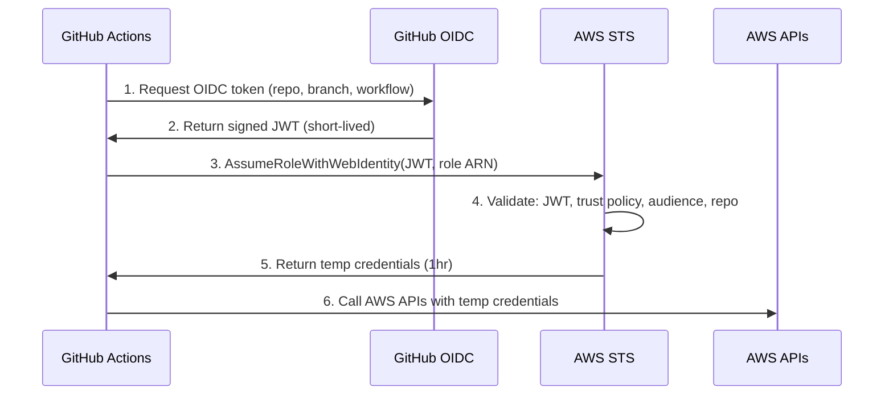

# AWS OIDC Setup for GitHub Actions

## Overview

This document explains OpenID Connect (OIDC) authentication between GitHub Actions and AWS. OIDC allows GitHub Actions workflows to securely authenticate to AWS without storing long-lived AWS credentials.

**Benefits over Access Keys:** No long-lived creds ✅ | Auto rotation ✅ | Reduced risk ✅ | Fine-grained access ✅ | IAM best practices ✅

---

## Infrastructure Components

### 1. GitHub OIDC Provider (AWS IAM)

**ARN:** `arn:aws:iam::984479408136:oidc-provider/token.actions.githubusercontent.com`

**Config:** Provider URL: `https://token.actions.githubusercontent.com` | Audience: `sts.amazonaws.com` | Thumbprint: Auto-managed

**View:** `AWS_PROFILE=kodekloud aws iam list-open-id-connect-providers`

### 2. IAM Role for GitHub Actions

**ARN:** `arn:aws:iam::984479408136:role/GitHubActions-AssumeRoleForActions`

**Trust Policy:**

```json
{
  "Version": "2012-10-17",
  "Statement": [{
    "Effect": "Allow",
    "Principal": {"Federated": "arn:aws:iam::984479408136:oidc-provider/token.actions.githubusercontent.com"},
    "Action": "sts:AssumeRoleWithWebIdentity",
    "Condition": {
      "StringLike": {"token.actions.githubusercontent.com:sub": "repo:wlevan3/*"},
      "StringEquals": {"token.actions.githubusercontent.com:aud": "sts.amazonaws.com"}
    }
  }]
}
```

**Conditions:** Repository: `repo:wlevan3/*` | Audience: `sts.amazonaws.com`
**Permissions:** AdministratorAccess (testing) → Least-privilege (production)

**View:** `AWS_PROFILE=kodekloud aws iam get-role --role-name GitHubActions-AssumeRoleForActions`

---

## How OIDC Authentication Works



**Token Claims:** `aud`=sts.amazonaws.com | `sub`=repo:wlevan3/* | `exp`=not expired | Signature=valid

**Temp Credentials:** Valid 1hr (max 12hr) | Scoped to role permissions | Auto-expire

---

## Usage in GitHub Actions

```yaml
permissions:
  id-token: write  # Required for OIDC
  contents: read

jobs:
  deploy:
    runs-on: ubuntu-latest
    steps:
      - uses: actions/checkout@v4

      - name: Configure AWS credentials
        uses: aws-actions/configure-aws-credentials@7474bc4690e29a8392af63c5b98e7449536d5c3a # v4.3.1
        with:
          role-to-assume: arn:aws:iam::984479408136:role/GitHubActions-AssumeRoleForActions
          aws-region: us-west-2
          role-session-name: GitHubActions-Deploy-${{ github.run_id }}

      - name: Verify AWS identity
        run: aws sts get-caller-identity
```

**Key params:** `role-to-assume` (IAM role ARN) | `aws-region` | `role-session-name` (CloudTrail tracking)

---

## Testing OIDC Setup

**Test workflow:** `.github/workflows/test-oidc-aws.yml`

```bash
gh workflow run test-oidc-aws.yml  # Manual trigger
gh run watch                       # Monitor
```

**Tests:** OIDC auth ✅ | Identity verification ✅ | S3 list ✅ | EC2 list ✅

---

## Troubleshooting

| Error | Cause | Solution |
|-------|-------|----------|
| `Not authorized to perform sts:AssumeRoleWithWebIdentity` | Trust policy mismatch | `aws iam get-role --query 'Role.AssumeRolePolicyDocument.Statement[0].Condition'` |
| `Missing permissions: id-token: write` | No OIDC permission | Add `permissions: id-token: write` to workflow |
| `Unable to assume role - invalid token` | OIDC validation failed | Verify `aud`=sts.amazonaws.com | Check OIDC provider exists |
| `Access Denied` on AWS APIs | Insufficient role perms | `aws iam list-attached-role-policies --role-name <role>` |

---

## Security Best Practices

### 0. Pin GitHub Actions to Commit SHAs

**Why:** Immutability ✅ | Supply chain security ✅ | Reproducibility ✅ | Transparency ✅

```yaml
# ❌ Less secure - version tag can be changed
uses: aws-actions/configure-aws-credentials@v4

# ✅ More secure - pinned to specific commit SHA
uses: aws-actions/configure-aws-credentials@7474bc4690e29a8392af63c5b98e7449536d5c3a # v4.3.1
```

### 1. Scope Role Permissions (Least Privilege)

**Current:** AdministratorAccess (testing) → **Production:** Least-privilege only

```json
{
  "Statement": [
    {"Effect": "Allow", "Action": ["s3:PutObject", "s3:GetObject"], "Resource": "arn:aws:s3:::my-bucket/*"},
    {"Effect": "Allow", "Action": ["ecs:UpdateService"], "Resource": "arn:aws:ecs:...:service/my-service"}
  ]
}
```

### 2. Restrict by Repository/Branch

**Trust Policy Patterns:**

| Restriction | Condition |
|-------------|-----------|
| Specific repo | `"sub": "repo:owner/repo:ref:refs/heads/main"` |
| Multiple repos | `"sub": ["repo:owner/repo1:*", "repo:owner/repo2:*"]` |
| Main branch only | `"sub": "repo:owner/*:ref:refs/heads/main"` |

### 3. Monitor and Audit

- **CloudTrail:** All AssumeRoleWithWebIdentity logged | Track workflows via `role-session-name`
- **CloudWatch:** Alert on unexpected assumptions | Monitor unusual API calls
- **Reviews:** Quarterly permission review | CloudTrail audit | Update trust policies

---

## Migration from Access Keys

### Before (Access Keys)

```yaml
- uses: aws-actions/configure-aws-credentials@v4
  with:
    aws-access-key-id: ${{ secrets.AWS_ACCESS_KEY_ID }}
    aws-secret-access-key: ${{ secrets.AWS_SECRET_ACCESS_KEY }}
    aws-region: us-west-2
```

### After (OIDC)

```yaml
permissions:
  id-token: write

- uses: aws-actions/configure-aws-credentials@7474bc4690e29a8392af63c5b98e7449536d5c3a # v4.3.1
  with:
    role-to-assume: arn:aws:iam::984479408136:role/GitHubActions-AssumeRoleForActions
    aws-region: us-west-2
```

**Steps:** Create OIDC provider ✅ | Create IAM role ✅ | Test OIDC ✅ | Update workflows ⏭️ | Remove secrets ⏭️ | Deactivate keys ⏭️

---

## References

**AWS:**

- [IAM OIDC Identity Providers][aws-oidc]
- [AssumeRoleWithWebIdentity API][aws-assume]
- [AWS Security Best Practices][aws-bp]

**GitHub:**

- [About security hardening with OIDC][gh-oidc]
- [Configuring OIDC in AWS][gh-aws]
- [GitHub Actions OIDC claims][gh-claims]

**Project:**

- `.github/workflows/test-oidc-aws.yml` - Test workflow
- `CLAUDE.md` - AWS profile configuration

[aws-oidc]: https://docs.aws.amazon.com/IAM/latest/UserGuide/id_roles_providers_create_oidc.html
[aws-assume]: https://docs.aws.amazon.com/STS/latest/APIReference/API_AssumeRoleWithWebIdentity.html
[aws-bp]: https://docs.aws.amazon.com/IAM/latest/UserGuide/best-practices.html
[gh-oidc]: https://docs.github.com/en/actions/deployment/security-hardening-your-deployments/about-security-hardening-with-openid-connect
[gh-aws]: https://docs.github.com/en/actions/deployment/security-hardening-your-deployments/configuring-openid-connect-in-amazon-web-services
[gh-claims]: https://docs.github.com/en/actions/deployment/security-hardening-your-deployments/about-security-hardening-with-openid-connect#understanding-the-oidc-token

---

## Infrastructure as Code (Future Enhancement)

**Current:** Manual via AWS Console | **Phase 2+:** Terraform (see example in original doc)

---

## Notes

- **Learning project:** Not production use
- **AWS Profile:** Use `AWS_PROFILE=kodekloud` for local CLI
- **Account:** 984479408136 (KodeKloud sandbox)

**Created:** 2025-11-03 | **Last Updated:** 2025-11-03
