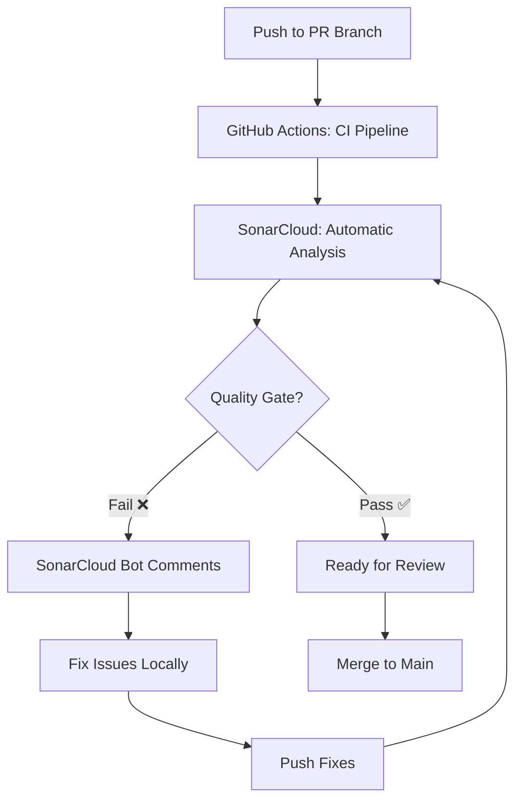

# SonarCloud Quality Standards

## Overview

This document establishes the code quality standards for this project using SonarCloud, a cloud-based static analysis
platform that identifies bugs, vulnerabilities, code smells, and security hotspots in our codebase.

### What is SonarCloud?

SonarCloud is an automated code quality and security analysis tool that:

- Identifies bugs before they reach production
- Detects security vulnerabilities and hotspots
- Measures test coverage and code duplication
- Tracks technical debt and maintainability issues
- Provides actionable feedback on every pull request

Think of it as a comprehensive code reviewer that runs automatically on every change.

### Why We Use It

As a learning project focused on production-grade engineering practices, SonarCloud helps:

- **Build quality habits**: Learn to write clean, secure code from the start
- **Practice professional workflows**: Experience industry-standard code quality gates
- **Understand trade-offs**: See the impact of technical debt and design decisions
- **Gain visibility**: Measure progress with objective quality metrics

### Integration Method

This project uses **Automatic Analysis via GitHub App** integration:

- ✅ Analysis runs automatically on every PR and push to `main`
- ✅ No CI job configuration needed
- ✅ No secrets management required (for now)
- ⚠️ Trade-off: Less control over analysis timing and configuration

**Future Migration** (Phase 3+): Will migrate to CI-based analysis using `SONAR_TOKEN` for finer control when
integrating with MLflow and more complex workflows.

### Project Configuration

- **Organization**: wlevan3
- **Project Key**: `wlevan3_ml-platform-engineering-practicum`
- **Dashboard**: [View Project on SonarCloud](https://sonarcloud.io/summary/new_code?id=wlevan3_ml-platform-engineering-practicum)
- **Quality Gate**: Sonar way (default)
- **Coverage Target**: 90% (project goal, exceeds 80% gate requirement)
- **Configuration File**: `sonar-project.properties`

---

## Understanding Quality Gates

### What is a Quality Gate?

A Quality Gate is a **binary pass/fail indicator** that determines whether your code meets minimum quality standards
before merging. It's the final checkpoint that ensures no low-quality code enters the main branch.

**Pass** ✅ → Code can be merged
**Fail** ❌ → Must fix issues before merging

### "Clean as You Code" Philosophy

SonarCloud follows the **"Clean as You Code"** approach, which focuses on:

- **New Code**: Quality standards apply to code you're currently changing
- **Overall Code**: Historical code quality is tracked but doesn't block merges

**Why This Matters:**

- Prevents new technical debt from accumulating
- Allows incremental improvement of existing code
- Makes quality gates achievable (you're not fixing the entire codebase in one PR)
- Encourages refactoring: when you touch old code, improve it

### New Code vs Overall Code

| Aspect | New Code | Overall Code |
|--------|----------|--------------|
| **Definition** | Lines added/changed in your PR or since last release | All code in the repository |
| **Quality Gate Impact** | ✅ **Blocks merge** if standards not met | 📊 Tracked for visibility only |
| **Focus** | Your responsibility in this PR | Historical reference |
| **Metrics** | Strict thresholds (80% coverage, A ratings) | Tracked trends over time |

**Example**: If the overall codebase has 70% coverage but your new code has 95% coverage, the Quality Gate **passes**
because new code meets the 80% threshold.

---

## Quality Gate Thresholds

This project uses the **"Sonar way"** quality gate (SonarCloud's default, industry-standard thresholds).

### Current Quality Gate: "Sonar way" (Default)

All conditions must **pass** for new code:

| Condition | Threshold | What It Means | How to Pass |
|-----------|-----------|---------------|-------------|
| **Reliability Rating** | A (value ≤ 1) | No new bugs | Fix all bugs in your changes |
| **Security Rating** | A (value ≤ 1) | No new vulnerabilities | Resolve all security issues |
| **Maintainability Rating** | A (value ≤ 1) | Minimal technical debt | Address code smells or accept debt consciously |
| **Coverage on New Code** | ≥ 80% | At least 80% of new code tested | Add tests for new functions/logic |
| **Duplicated Lines Density** | ≤ 3% | Less than 3% code duplication | Refactor duplicated code blocks |
| **Security Hotspots Reviewed** | 100% | All security-sensitive code reviewed | Review and mark hotspots as safe/fixed |

**Current Status**: ✅ **PASSING** (as of last analysis)

- Reliability: A (1.0)
- Security: A (1.0)
- Maintainability: A (1.0)
- Duplication: 0.0% (excellent)
- Security Hotspots: 100% reviewed

### Project Coverage Target: 90%

While the Quality Gate requires **≥80%** coverage for new code, this project aims for **90%** as a stretch goal to:

- Build strong testing habits
- Ensure comprehensive test coverage
- Practice test-driven development (TDD)
- Prepare for production-grade requirements

**Note**: 90% is a *goal*, not a blocker. PRs with ≥80% coverage will pass the gate, but strive for 90%+ to build
better testing discipline.

---

## Viewing Reports

### Accessing the SonarCloud Dashboard

1. **From README Badges**:
   - Click any quality badge in the README
   - Direct link: [SonarCloud Dashboard](https://sonarcloud.io/summary/new_code?id=wlevan3_ml-platform-engineering-practicum)

2. **From Pull Requests**:
   - Check the PR status checks section
   - Look for "SonarCloud Code Analysis" status
   - Click "Details" to view full report

3. **From GitHub App**:
   - SonarCloud bot comments on PRs with quality gate status
   - Inline comments on specific lines with issues

### Navigating the Dashboard

**Main Dashboard Sections**:

- **Overview**: Quality Gate status, ratings, coverage, duplications at a glance
- **Issues**: Browse all bugs, vulnerabilities, code smells, security hotspots
- **Measures**: Detailed metrics (lines of code, complexity, test coverage)
- **Code**: Source code browser with inline issue markers
- **Activity**: Analysis history and quality trends over time

**Filtering Issues**:

- **Type**: Bugs, Vulnerabilities, Code Smells, Security Hotspots
- **Severity**: Blocker, Critical, Major, Minor, Info
- **Status**: Open, Confirmed, Resolved, Reopened
- **Time Period**: New Code (last 30 days by default) or Overall Code

---

## Issue Types Explained

SonarCloud categorizes issues into four types based on their impact:

### 1. Bugs (Reliability)

**Definition**: Code that is wrong and will likely break at runtime.

**Examples**:

- Null pointer dereference
- Division by zero
- Unreachable code after return
- Incorrect exception handling
- Type mismatches

**Impact**: ❌ **Application crashes or incorrect behavior**

**Example**:

```python
# Bug: Potential IndexError
def get_first_item(items):
    return items[0]  # What if items is empty?

# Fix: Add bounds checking
def get_first_item(items):
    if not items:
        raise ValueError("List is empty")
    return items[0]
```

### 2. Vulnerabilities (Security)

**Definition**: Security flaws that attackers can exploit.

**Examples**:

- SQL injection risks
- Command injection vulnerabilities
- Hardcoded credentials
- Insecure cryptography
- Path traversal issues

**Impact**: 🔓 **Security breach, data loss, unauthorized access**

**Example**:

```python
# Vulnerability: SQL injection
def get_user(username):
    query = f"SELECT * FROM users WHERE username = '{username}'"
    # Attacker input: "admin' OR '1'='1"

# Fix: Use parameterized queries
def get_user(username):
    query = "SELECT * FROM users WHERE username = %s"
    cursor.execute(query, (username,))
```

### 3. Code Smells (Maintainability)

**Definition**: Maintainability issues that make code harder to understand, change, or extend.

**Examples**:

- Functions too long or complex
- Duplicated code blocks
- Too many parameters
- Dead code (unused variables, functions)
- Poor naming conventions

**Impact**: 🐌 **Slower development, harder to debug, technical debt accumulation**

**Example**:

```python
# Code Smell: Cognitive complexity too high
def process_data(data, flag1, flag2, flag3):
    if flag1:
        if flag2:
            if flag3:
                # 20 lines of nested logic
                pass
    # Fix: Break into smaller functions, use early returns
```

### 4. Security Hotspots (Review Required)

**Definition**: Security-sensitive code that requires manual review (not necessarily a vulnerability).

**Examples**:

- Authentication logic
- Authorization checks
- Cryptographic operations
- File system access
- Network connections

**Impact**: ⚠️ **Needs human judgment to determine if implementation is secure**

**Example**:

```python
# Security Hotspot: Password handling
def hash_password(password):
    # SonarCloud flags this for review: Is bcrypt configured correctly?
    return bcrypt.hashpw(password.encode(), bcrypt.gensalt())

# Action: Review and mark as "Safe" if bcrypt settings are production-grade
```

---

## Interpreting Ratings

### A-E Rating Scale

SonarCloud uses letter grades (A-E) for Reliability, Security, and Maintainability:

| Rating | Meaning | Bugs | Vulnerabilities | Technical Debt Ratio |
|--------|---------|------|-----------------|---------------------|
| **A** 🟢 | Excellent | 0 | 0 | ≤ 5% |
| **B** 🟡 | Good | ≥ 1 Minor | ≥ 1 Minor | 6-10% |
| **C** 🟠 | Fair | ≥ 1 Major | ≥ 1 Major | 11-20% |
| **D** 🔴 | Poor | ≥ 1 Critical | ≥ 1 Critical | 21-50% |
| **E** ⛔ | Very Poor | ≥ 1 Blocker | ≥ 1 Blocker | > 50% |

**Goal**: Maintain **A ratings** on all three metrics for new code.

### Severity Levels

Issues are assigned severity based on their potential impact:

| Severity | Icon | When to Use | Time to Fix |
|----------|------|-------------|-------------|
| **Blocker** ⛔ | Must fix immediately | Application crashes, data loss, security breach | < 1 hour |
| **Critical** 🔴 | Fix before merge | Likely bugs, security vulnerabilities | < 4 hours |
| **Major** 🟠 | Fix soon | Code smells affecting maintainability | < 1 day |
| **Minor** 🟡 | Fix when convenient | Small maintainability issues | < 1 week |
| **Info** ℹ️ | Optional | Suggestions, best practices | As time allows |

**Rule of Thumb**: Fix all Blocker and Critical issues before merging. Major issues should be addressed or consciously
accepted as technical debt.

### Technical Debt Ratio

**Formula**: `(Estimated fix time / Development time) × 100`

**Example**: If SonarCloud estimates 4 hours to fix issues in code that took 80 hours to write:

- Technical Debt Ratio = (4 / 80) × 100 = **5%** → **A Rating**

**Thresholds**:

- **A**: ≤ 5% (excellent)
- **B**: 6-10% (acceptable)
- **C**: 11-20% (needs attention)
- **D-E**: > 20% (refactor recommended)

---

## Addressing Findings

### Step-by-Step Remediation Workflow

#### 1. Review Quality Gate Status

After pushing changes:

```bash
# Check PR status
gh pr checks

# Look for "SonarCloud Code Analysis" status
# ✅ Pass → Continue with review
# ❌ Fail → View details and fix issues
```

#### 2. Navigate to Issue Report

- Click "Details" on SonarCloud check in PR
- Or visit: [Project Dashboard](https://sonarcloud.io/summary/new_code?id=wlevan3_ml-platform-engineering-practicum)
- Filter by "New Code" to see issues in your PR

#### 3. Prioritize by Severity

**Fix Order**:

1. ⛔ **Blockers** → Fix immediately
2. 🔴 **Critical** → Fix before merge
3. 🟠 **Major** → Fix or document why deferring
4. 🟡 **Minor** → Fix if time permits
5. ℹ️ **Info** → Consider for future refactoring

#### 4. Fix Issues Locally

##### Example: Fixing a Bug (Null Pointer)

```python
# SonarCloud Issue: "NoneType object has no attribute 'predict'"
# File: app/model.py, Line 45

# Before (Bug)
def predict(features):
    model = get_model()
    return model.predict(features)  # What if model is None?

# After (Fixed)
def predict(features):
    model = get_model()
    if model is None:
        raise RuntimeError("Model not loaded")
    return model.predict(features)
```

#### 5. Test Fixes

```bash
# Run tests locally
pytest

# Check coverage
pytest --cov=app --cov-report=term-missing

# Verify fix doesn't break existing tests
pytest -v
```

#### 6. Push and Re-Analyze

```bash
# Commit fix
git add .
git commit -m "fix(model): add null check for model loading"

# Push to PR branch
git push

# SonarCloud automatically re-analyzes
# Wait ~1-2 minutes, check PR status
gh pr checks --watch
```

#### 7. Verify Quality Gate Passes

- SonarCloud bot comments with updated status
- Green ✅ check → Ready for review
- Red ❌ check → Repeat steps 2-6

### Common Issues and Fixes

#### Issue: Coverage Below 80%

**SonarCloud Message**: "Coverage on New Code is 65.0%, expected ≥ 80%"

**Fix**:

```bash
# Identify untested code
pytest --cov=app --cov-report=term-missing

# Output shows lines not covered:
# app/model.py: 45-52 (8 lines not covered)

# Add tests for missing coverage
# tests/test_model.py
def test_model_loading_with_invalid_path():
    with pytest.raises(FileNotFoundError):
        load_model("invalid/path.joblib")
```

#### Issue: Code Duplication > 3%

**SonarCloud Message**: "Duplicated Lines Density is 5.2%, expected ≤ 3%"

**Fix**:

```python
# Before: Duplicated code
def get_user_by_id(user_id):
    connection = get_db_connection()
    cursor = connection.cursor()
    cursor.execute("SELECT * FROM users WHERE id = %s", (user_id,))
    return cursor.fetchone()

def get_user_by_email(email):
    connection = get_db_connection()
    cursor = connection.cursor()
    cursor.execute("SELECT * FROM users WHERE email = %s", (email,))
    return cursor.fetchone()

# After: Refactored (no duplication, with field validation)
def get_user(field, value):
    # Whitelist approach to prevent SQL injection
    allowed_fields = {"id", "email"}
    if field not in allowed_fields:
        raise ValueError(f"Invalid field name: {field}")

    connection = get_db_connection()
    cursor = connection.cursor()
    # Safe: field is validated against whitelist before interpolation
    cursor.execute(f"SELECT * FROM users WHERE {field} = %s", (value,))
    return cursor.fetchone()

def get_user_by_id(user_id):
    return get_user("id", user_id)

def get_user_by_email(email):
    return get_user("email", email)
```

#### Issue: Cognitive Complexity Too High

**SonarCloud Message**: "Cognitive Complexity is 18, expected ≤ 15"

**Fix**: Break down complex functions

```python
# Before: Complex nested logic (cognitive complexity = 18)
def process_request(request):
    if request.method == "POST":
        if request.authenticated:
            if request.has_permission("write"):
                if validate_data(request.data):
                    # Process...
                    pass

# After: Early returns (cognitive complexity = 8)
def process_request(request):
    if request.method != "POST":
        return error_response("Invalid method")
    if not request.authenticated:
        return error_response("Unauthorized")
    if not request.has_permission("write"):
        return error_response("Forbidden")
    if not validate_data(request.data):
        return error_response("Invalid data")

    return process_data(request.data)
```

### When to Mark as False Positive

**Criteria for "Won't Fix" or "False Positive"**:

- ✅ Issue is not applicable to this context
- ✅ Fix would make code worse (less readable, less performant)
- ✅ Issue is in generated or third-party code
- ❌ **DON'T** mark as false positive just to pass the gate

**How to Mark**:

1. Go to issue in SonarCloud dashboard
2. Click "..." menu → "Change Status"
3. Select "Won't Fix" or "False Positive"
4. **Add comment explaining why** (required for learning/documentation)

**Example**:

```python
# SonarCloud flags this as "unused variable"
# But we need it for unpacking a tuple
def get_coordinates():
    x, y, z = calculate_3d_position()  # z flagged as unused
    return x, y  # We only need x, y for 2D projection

# Comment in SonarCloud: "z is intentionally unused - function returns 3D
# but we only use 2D projection. Alternative would be calculate_2d_position()
# but that function doesn't exist in the library."
```

---

## Integration with Workflow

### When Analysis Runs

SonarCloud Automatic Analysis triggers on:

- ✅ Every push to a pull request branch
- ✅ Every merge to `main` branch
- ✅ Manual trigger via SonarCloud dashboard (if needed)

**Timing**: Analysis typically completes in 1-2 minutes for this project size.

### Pull Request Workflow



### What Happens When Quality Gate Fails?

1. **PR Status Check**: ❌ Red "SonarCloud Code Analysis" check
2. **Bot Comment**: SonarCloud bot comments on PR with summary
3. **Email Notification**: (if configured) Email with issue details
4. **Merge Blocked**: Cannot merge until gate passes (branch protection)

**Your Action**:

- Review issues in SonarCloud dashboard
- Fix locally following remediation workflow above
- Push fixes → automatic re-analysis

### IDE Integration (Optional but Recommended)

**SonarLint** is a free IDE extension that provides real-time feedback as you code:

**Installation**:

- **VS Code**: Install "SonarLint" extension
- **PyCharm**: Install "SonarLint" plugin
- **Other IDEs**: Check [SonarLint Downloads](https://www.sonarsource.com/products/sonarlint/)

**Benefits**:

- 🔍 See issues before committing
- ⚡ Faster feedback loop (seconds vs minutes)
- 📚 Learn best practices through inline explanations
- 🎯 Fix issues at the source (while code is fresh in mind)

**Setup**:

1. Install SonarLint extension
2. Connect to SonarCloud (optional, requires authentication)
3. Bind to project: `wlevan3_ml-platform-engineering-practicum`
4. Start coding → Issues appear inline with suggestions

---

## Configuration Reference

### `sonar-project.properties`

This file configures SonarCloud analysis for the project:

```properties
# Project identification
sonar.projectKey=wlevan3_ml-platform-engineering-practicum
sonar.organization=wlevan3
sonar.projectName=ML Platform Engineering Practicum
sonar.projectVersion=1.0.0

# Python version
sonar.python.version=3.13

# Source and test paths
sonar.sources=app/
sonar.tests=tests/

# Coverage report location
sonar.python.coverage.reportPaths=coverage.xml

# Exclusions (not analyzed)
sonar.exclusions=**/__pycache__/**,**/models/**,**/.venv/**,**/node_modules/**,**/*.pyc

# Encoding
sonar.sourceEncoding=UTF-8
```

**Key Settings**:

- **sonar.sources**: Application code to analyze (`app/`)
- **sonar.tests**: Test code (`tests/`) - excluded from coverage calculation
- **sonar.python.coverage.reportPaths**: Where pytest generates `coverage.xml`
- **sonar.exclusions**: Patterns to ignore (virtual env, cache, model files)

**Why Exclude Models?**:

- Model files (`.joblib`) are binary, not source code
- No value in analyzing serialized model artifacts
- Keeps analysis focused on actual Python code

### `pytest.ini` Coverage Configuration

```ini
[pytest]
testpaths = tests
python_files = test_*.py
python_classes = Test*
python_functions = test_*

[coverage:run]
source = app
omit =
    tests/*
    .venv/*
    models/*
    **/__pycache__/*
    **/*.pyc

[coverage:report]
show_missing = True
precision = 2
```

**How Coverage Flows to SonarCloud**:

1. `pytest --cov=app --cov-report=xml` generates `coverage.xml`
2. File uploaded to GitHub as artifact (`.github/workflows/ci.yml`)
3. SonarCloud Automatic Analysis reads `coverage.xml` during analysis
4. Coverage metrics appear in SonarCloud dashboard

---

## Automatic Analysis vs CI-Based Analysis

### Current: Automatic Analysis (GitHub App)

**How It Works**:

- SonarCloud GitHub App installed on repository
- Analysis triggered automatically by GitHub events (push, PR)
- No secrets or tokens required
- No CI job configuration needed

**Pros**:

- ✅ Simple setup (one-time GitHub App installation)
- ✅ No secret management
- ✅ Faster initial setup
- ✅ Automatic coverage detection

**Cons**:

- ❌ Less control over analysis timing
- ❌ Cannot customize analysis steps
- ❌ Harder to debug analysis issues
- ❌ Limited to GitHub App permissions

### Future: CI-Based Analysis (Phase 3+)

**How It Will Work**:

- Add explicit SonarCloud job to `.github/workflows/ci.yml`
- Use `SONAR_TOKEN` secret for authentication
- Full control over analysis parameters and timing

**Pros**:

- ✅ Full control over when analysis runs
- ✅ Can pass custom parameters
- ✅ Easier to debug (visible in CI logs)
- ✅ Can integrate with other CI steps (e.g., wait for MLflow)

**Cons**:

- ❌ More complex setup
- ❌ Requires secret management (token rotation)
- ❌ Need to maintain CI job configuration

**Migration Plan** (Phase 3):

- When integrating MLflow Model Registry (Phase 3)
- Need to coordinate analysis with model deployment
- Will add `sonarcloud-analysis` job to CI pipeline
- `SONAR_TOKEN` secret will be activated

**Why Wait?**:

- Current Automatic Analysis meets Phase 1-2 needs
- Avoid premature complexity
- Learn the basics first, add control later
- Document the evolution (learning project)

---

## FAQ

### Why focus on "New Code" instead of "Overall Code"?

**Answer**: The "Clean as You Code" philosophy prevents new technical debt without requiring you to fix the entire
codebase in one PR. As you touch code over time, quality improves incrementally.

**Example**: Imagine inheriting a codebase with 50% test coverage. Requiring 80% overall coverage would mean writing
hundreds of tests before any feature work. Instead, requiring 80% coverage on *new code* lets you:

- Make progress on features immediately
- Improve coverage gradually (whenever you touch old code)
- Prevent quality from getting worse

### What if I can't reach 80% coverage on new code?

**Options**:

1. **Add more tests** (preferred) - Write unit tests for untested logic
2. **Refactor** - Extract hard-to-test logic into testable functions
3. **Justify exception** - If code is truly untestable (rare), document why in PR description
4. **Mark as "Won't Fix"** - Only if genuinely not worth testing (e.g., trivial getters)

**Before marking as exception**: Ask yourself:

- Is this code important enough to be in production?
- If yes, it's important enough to test

### How do I handle issues in third-party or generated code?

**Answer**: Exclude those files from analysis:

1. Add pattern to `sonar.exclusions` in `sonar-project.properties`
2. Example: `sonar.exclusions=**/generated/**,**/vendor/**`
3. Push change → SonarCloud will ignore those files in future analyses

**Note**: Don't exclude code you wrote just to avoid issues. Only exclude truly external code.

### Can I run SonarCloud analysis locally?

**Answer**: Partially. You can:

- ✅ Use **SonarLint** IDE extension for real-time feedback (recommended)
- ⚠️ Run **SonarScanner CLI** locally (requires `SONAR_TOKEN`, complex setup)

**Recommendation**: Use SonarLint for immediate feedback, rely on Automatic Analysis for official reports.

### What if SonarCloud and my linters (Black, Ruff) disagree?

**Answer**: Project preference:

1. **Black** and **Ruff** take precedence (configured in `pre-commit`)
2. If SonarCloud flags something Black/Ruff allow, evaluate case-by-case
3. If Black/Ruff are correct for this project, mark SonarCloud issue as "Won't Fix"
4. Document reasoning in SonarCloud comment

**Example**: SonarCloud might suggest different string formatting than Black enforces. Trust Black (configured for this
project), mark SonarCloud issue as "Won't Fix" with comment explaining Black is authoritative.

### How often should I check SonarCloud reports?

**Answer**:

- 🔴 **Every PR**: Before requesting review (check Quality Gate status)
- 🟡 **After merge**: Review overall project metrics (optional, for learning)
- 🟢 **Weekly**: Check dashboard to see quality trends (optional, for learning)

**Minimum**: Always check PR status before requesting review.

---

## Learning Reflections

### Key Takeaways

1. **Quality Gates Enforce Discipline**: Binary pass/fail creates clear standards
2. **New Code Focus is Liberating**: Don't need to fix everything, just don't make it worse
3. **Severity Matters**: Blocker != Minor. Prioritize ruthlessly.
4. **Coverage Drives Design**: Striving for 90% coverage forces better architecture
5. **Automation Reduces Friction**: Automatic Analysis removes excuse of "forgot to run analysis"

### Trade-offs Observed

| Decision | Benefit | Cost | Verdict |
|----------|---------|------|---------|
| Automatic Analysis vs CI-based | Simplicity | Less control | ✅ Right for Phase 1-2 |
| 90% coverage target vs 80% gate | Better testing habits | More effort | ✅ Worth it for learning |
| SonarLint IDE integration | Real-time feedback | Setup time | ✅ Recommended |
| Strict Quality Gate (blocks merges) | Prevents technical debt | Slower PRs | ✅ Aligns with learning goals |

### Evolution Plan

**Phase 1-2** (Current): Automatic Analysis, learn the basics
**Phase 3**: Migrate to CI-based analysis when integrating MLflow
**Phase 4+**: Custom quality profiles, stricter thresholds as skills grow

---

## Additional Resources

### Official Documentation

- [SonarCloud Documentation](https://docs.sonarcloud.io/)
- [SonarQube Python Rules](https://docs.sonarsource.com/sonarqube/latest/analyzing-source-code/languages/python/)
- [Quality Gates Explained](https://docs.sonarcloud.io/improving/quality-gates/)
- [Clean as You Code](https://docs.sonarcloud.io/improving/clean-as-you-code/)

### SonarLint Integration

- [SonarLint Downloads](https://www.sonarsource.com/products/sonarlint/)
- [SonarLint for VS Code](https://marketplace.visualstudio.com/items?itemName=SonarSource.sonarlint-vscode)
- [SonarLint for PyCharm](https://plugins.jetbrains.com/plugin/7973-sonarlint)

### Project-Specific Links

- [Project Dashboard](https://sonarcloud.io/summary/new_code?id=wlevan3_ml-platform-engineering-practicum)
- [Quality Gate Details](https://sonarcloud.io/project/quality_gate?id=wlevan3_ml-platform-engineering-practicum)
- [Project Issues](https://sonarcloud.io/project/issues?id=wlevan3_ml-platform-engineering-practicum)
- [Project Measures](https://sonarcloud.io/component_measures?id=wlevan3_ml-platform-engineering-practicum)

### Internal Documentation

- [CONTRIBUTING.md](../CONTRIBUTING.md) - Development workflow and code standards
- [QUICK_REFERENCE.md](QUICK_REFERENCE.md) - Commands and links reference
- [PICKLE_SECURITY.md](PICKLE_SECURITY.md) - Model security analysis (example of deep-dive doc)

---

**Document Version**: 1.0
**Last Updated**: 2025-11-02
**Next Review**: Phase 3 (MLflow Integration) or after 3 months of use
